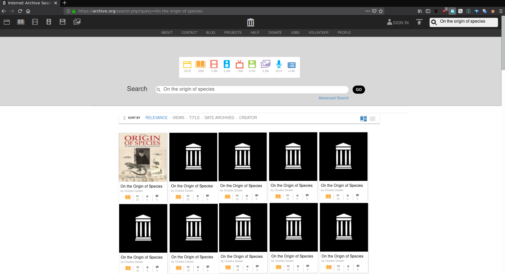
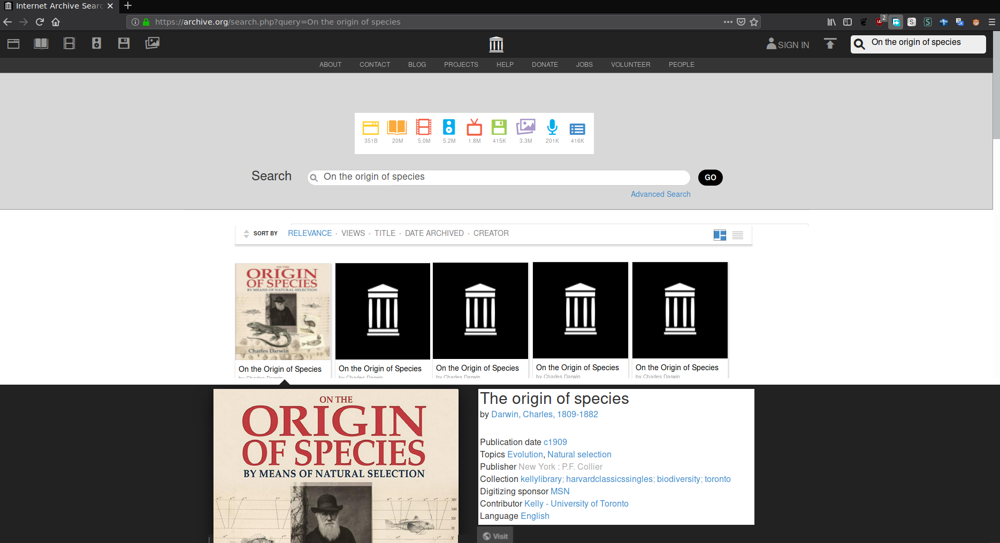
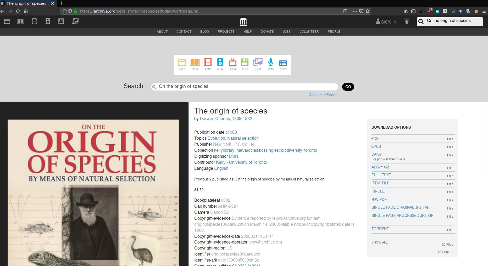
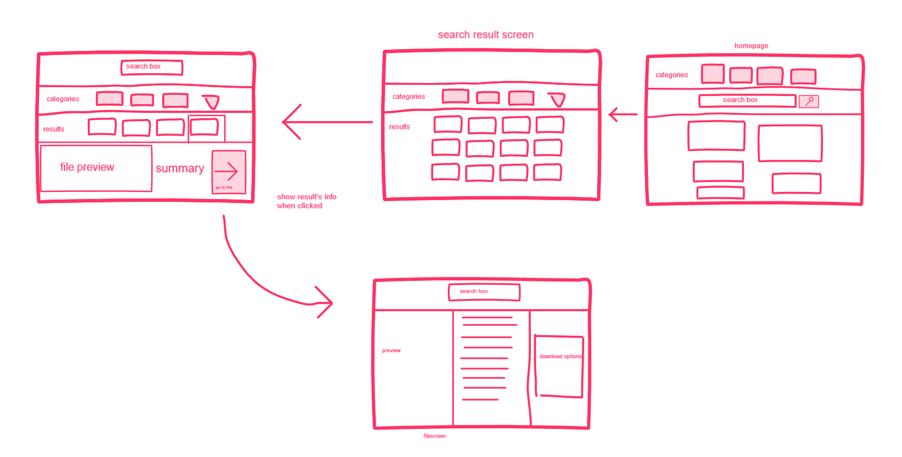

# Usability Evaluation and Prototyping
> Usability Evaluation in this assignment is to evaluate your high-fidelity interactive-prototype with two participants:
> the participant from the previous Contextual Inquiry (CI) 
> and an additional novice-participant with different demographics if possible.
> Respectively, revise your prototype as an attempt to fix any problems found in this Usability Evaluation.

## Operating the Prototype

Link to video: https://youtu.be/vzPNqG5VtPI

---

## Part A: Usability Evaluation

### 1. Brief Description of Participants

#### a. Description of Participant 1
 - Previous CI participant
 - Around 20 years old
 - Currently a college student
 - Male
 - Uses internet mostly to browse, social media, and gaming

#### b. Description of Participant 2
Lorem Ipsum is simply dummy text of the printing and typesetting industry. Lorem Ipsum has been the industry's standard dummy text ever since the 1500s, when an unknown printer took a galley of type and scrambled it to make a type specimen book.

### 2. Evaluation Script
 - Just interact with the prototype and tells me what you think about it

### 3. Transcript

#### a. Transcript with Participant 1
```
A: Me
B: CI Subject

1.  A: Jadi nanti kamu coba terus komentarmu gimana.
2.  B: Kok nggak bisa di-scroll?
3.  A: Nggak bisa soalnya aku cuma bikin segitu aja.
4.  B: *clicks the search button*
5.  B: Udah?
6.  A: Lanjutin sekarang searh resultnya.
7.  B: *clicks the search result.
8.  B: Ini kalo divisit apa langsung ke web aslinya?
9.  A: Enggak. Cuma gambar ini.
10. B: Oalah. Iya ya.
11. A: Kalo diklik search button balik ke yang tadi lagi.
12. B: Terus ngapain sekarang?
13. A: Liat tampilannya terus komentarmu gimana. Susahnya dimana.
14. B: Menurutku gampang soalnya hasilnya langsung keluar.
15. B: Kurangnya menurutku di search result nggak ada sinopsisnya.
```

#### b. Transcript with Participant 2
```
```

### 4. Feedback and Incidence Analysis
> Record your observations per prototype screen followed by reference, feedback, incidence, reason, and resolution.

#### OBSERVATION 1


 - **Reference**: -
 - **Feedback**: -
 - **Incidence**: -
 - **Reason**: -
 - **Resolution**: -
 
#### OBSERVATION 2


 - **Reference**: -
 - **Feedback**: -
 - **Incidence**: -
 - **Reason**: -
 - **Resolution**: -
 
#### OBSERVATION 3


 - **Reference**: Participant 1 line 15  
 - **Feedback**: Negative feedback
 - **Incidence**: Clicking search results shows properties
 - **Reason**: No summary of search result (a book in this case)
 - **Resolution**: Change the properties to a summary
 

#### OBSERVATION 4


 - **Reference**: -  
 - **Feedback**: -
 - **Incidence**: -
 - **Reason**: -
 - **Resolution**: -
 
 ---

## Part B: Prototyping (again)

### Sketch



### Design Rationale
Showing a summary of the result so users can check if it's indeed the result they are searching.

### High-Fidelity Interactive-Prototype

https://invis.io/D4S35M1JN26#/364098004_Screen4
